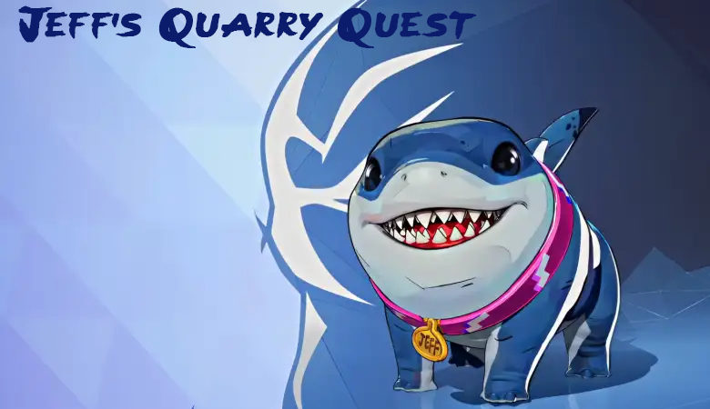

## Overview
This project is a school-developed game using Vulkan, ImGui and EnTT to create a **2D-style** experience in a **3D** environment. The game is packaged with an installer for easy setup. **Jeff's Quarry Quest** is a *Dig Dug* inspired arcade game that features Jeff the Land Shark digging through dirt to defeat enemy sea creatures.

## Installation
Download the installer from this repository and follow the installation prompts. A separate readme will be displayed after installation with additional details.

## Contributers
- [Anthony Bailey](https://github.com/mrabailey96) - Implemented digging mechanics, ImGui, and created gameplay UI.
- [Antony Castro](https://github.com/antonyxabier) - Assisted with game audio/SFX and debugging, managed win/lose game states.
- [Koda Durbin](https://github.com/koda-doka) - Worked on blender models, high-score system, and contributed to gameplay UI.
- [Rex Mejia](https://github.com/Rmejia03) - Developed the title/main menu functionality and helped design enemy AI.
- [Marcos Salinas](https://github.com/Merkz10) - Programmed enemy AI, added level transitions, and incorporated game music.
